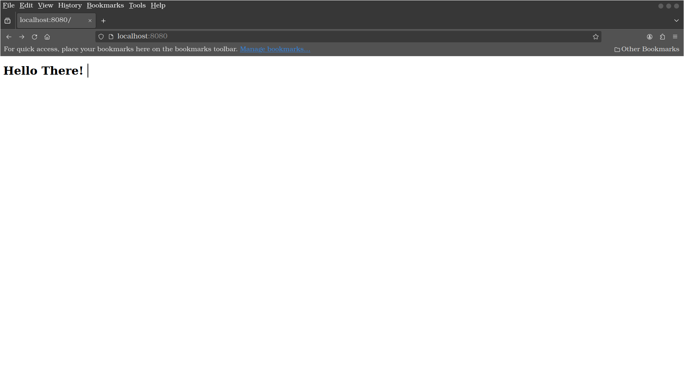

# How to run

1. Clone repository `git clone https://github.com/Lepecin/app-test`
2. Open terminal and cd to `/.../path/to/app-test`
3. Activate docker daemon locally
4. Run `docker compose up --build -d`
5. Goto `localhost:8080`

